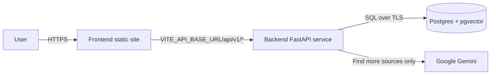

# CableIncidentsDB

Interactive map of submarine cable incidents layered on Telegeography cable routes.

- **Frontend:** React, TypeScript, Tailwind CSS, MapLibre GL JS
- **Backend:** FastAPI (Python)
- **Data:** `incidents.csv`, `cables_shortened.csv`, Telegeography GeoJSON snapshot
- **Vector DB (optional):** PostgreSQL + [pgvector](https://github.com/pgvector/pgvector) for semantic search, with embeddings computed locally ([fastembed](https://github.com/qdrant/fastembed), ONNX Runtime) — no API key needed, and much lighter on memory than a PyTorch-based model
- **AI-found sources (optional):** Google Gemini, for suggesting additional sources on an incident

`combined.xlsx` is kept as an archive only and is **not** used by the application.

## Quick start (Docker)

```bash
docker compose up --build
```

- Web: http://localhost:5174
- API: http://localhost:8001 (docs at `/docs`)

That's it — the map, incident list, filters, grouped-marker clicks, **and semantic search** all work with just this command, no API key required. On startup, the API automatically checks whether the vector DB is populated and loads it in the background if not, using a local embedding model (a few minutes the first time — mostly a one-time model download; it doesn't block the app from being usable meanwhile, and it's skipped instantly on every later restart once the data's loaded). If it doesn't come up, see [Troubleshooting](#troubleshooting).

**Want AI-found sources too?** (The **"Find more sources"** button on an incident's detail panel, which asks Gemini to web-search for additional sources not already in the dataset — clearly labeled as AI-found and unverified.) Get a free key from [Google AI Studio](https://aistudio.google.com/apikey), put it in a `.env` file next to `docker-compose.yml` (already gitignored, safe to keep a real key in it):

```bash
echo 'GOOGLE_API_KEY=your-key-here' > .env
```

Then run `docker compose up --build` as above. Without a key, the button just shows a friendly "unavailable" message — nothing else breaks, and semantic search is unaffected either way since it doesn't use this key.

To refresh the vector DB after editing the CSVs (instead of waiting for the next restart's automatic check):

```bash
docker compose exec api python -m scripts.ingest_vectordb --database-url postgresql://cableincidents:cableincidents@db:5432/cableincidents
```

## Local development (without Docker)

### Backend

```bash
cd backend
python -m pip install -r requirements.txt
python -m uvicorn app.main:app --reload --host 127.0.0.1 --port 8001
```

### Frontend

In a second terminal:

```bash
cd frontend
npm install
npm run dev
```

Open http://localhost:5174 — the Vite dev server proxies `/api` to the backend on port 8001.

For semantic search locally (without Docker), run Postgres yourself (with the pgvector extension) and set `CABLEINCIDENTS_DATABASE_URL` as an environment variable before starting the backend — the same automatic background setup described above runs for local `uvicorn` too, so there's no separate ingest step needed there either, and no API key. For AI-found sources, also set `GOOGLE_API_KEY`. See `backend/.env.example` for the full list of variables.

## Deploying to a free host

This app splits cleanly into a static frontend and a small API, which fits most free hosting tiers:



A working free-tier combination: **Vercel or Netlify** for the frontend, **Render** (free web service) for the backend, and **Supabase** (free Postgres project) for the vector database. Any equivalent free static host / container host / Postgres-with-pgvector provider works the same way.

### 1. Database (only needed for semantic search)

1. Create a free Supabase (or Neon) Postgres project.
2. In the SQL editor, enable the extension: `create extension if not exists vector;`
3. Once the backend is deployed (step 2 below) with `CABLEINCIDENTS_DATABASE_URL` set, it automatically applies `backend/db/schema.sql` and populates the vector DB in the background on its first startup, no API key or manual step needed. To pre-seed it yourself instead (or refresh it later), run from your machine:
   ```bash
   cd backend
   python -m scripts.ingest_vectordb --database-url "<your-supabase-connection-string>"
   ```

### 2. Backend

Deploy `backend/` (its `Dockerfile` works as-is) to a free container host such as Render. Set these environment variables:

| Variable | Value |
|----------|-------|
| `GOOGLE_API_KEY` | Your Gemini API key (only needed for AI-found sources) |
| `CABLEINCIDENTS_DATABASE_URL` | Your Supabase/Neon connection string (skip if not using semantic search) |
| `CABLEINCIDENTS_CORS_ORIGINS` | JSON array with your deployed frontend URL, e.g. `["https://your-app.vercel.app"]` |

The service listens on port 8001 (see `backend/Dockerfile`). Local embeddings use `fastembed` (ONNX Runtime, no PyTorch), which is intentionally chosen over `sentence-transformers` to stay well under memory-capped free tiers like Render's 512MB instance — importing PyTorch alone can eat 150-300MB before a model is even loaded.

### 3. Frontend

Deploy `frontend/` to a free static host (Vercel, Netlify, or similar):

- Build command: `npm run build`
- Output directory: `dist`
- Environment variable: `VITE_API_BASE_URL=https://<your-backend-host>/api/v1`

### Notes

- Free container tiers (e.g. Render) typically spin down when idle, so the first request after inactivity can take 30-60 seconds.
- Only AI-found sources calls the Gemini API and is subject to its free-tier rate limits; semantic search runs entirely locally.
- Telegeography map data is licensed for non-commercial use — see the [License note](#license-note) below before hosting publicly.

## Troubleshooting

- **`docker compose up` fails immediately** — usually a stale image. Run `docker compose up --build` to force a rebuild (needed any time `requirements.txt` or `package.json` changes).
- **Map loads but says "Could not load map data"** — the API container isn't reachable. Check `docker compose logs api` for the actual error.
- **Search box shows "keyword matches only" instead of semantic results** — the vector DB is likely still loading in the background (check `docker compose logs api` for progress — the first load takes a few minutes, mostly a one-time model download), or the API container can't reach Postgres, or it has no outbound internet access for that first model download. The rest of the app keeps working either way.
- **"Find more sources" shows an error** — expected without `GOOGLE_API_KEY`. The rest of the app keeps working either way.

## Data

| File | Purpose |
|------|---------|
| `data/incidents.csv` | 243 incident records |
| `data/cables_shortened.csv` | 698 cable metadata rows |
| `data/telegeography/` | Pinned Telegeography API v3 snapshot |

To refresh Telegeography data, re-download and update `data/telegeography/VERSION.txt` with the fetch date:

- `https://www.submarinecablemap.com/api/v3/cable/cable-geo.json`
- `https://www.submarinecablemap.com/api/v3/landing-point/landing-point-geo.json`
- `https://www.submarinecablemap.com/api/v3/cable/all.json`

## API endpoints

| Method | Path | Description |
|--------|------|-------------|
| GET | `/api/v1/health` | Service health + counts |
| GET | `/api/v1/cables` | Cable list with incident counts |
| GET | `/api/v1/cables/{name}` | Cable detail + incidents |
| GET | `/api/v1/incidents` | All incidents |
| GET | `/api/v1/incidents/{id}` | Single incident |
| GET | `/api/v1/markers` | Map marker groups |
| GET | `/api/v1/map/cables` | Cable GeoJSON |
| GET | `/api/v1/map/landing-points` | Landing point GeoJSON |
| GET | `/api/v1/search` | Semantic search over incidents/cables (no API key needed; auto-populated in the background on startup) |
| GET | `/api/v1/incidents/{id}/sources` | Dataset sources + AI-found additional sources for one incident (needs `GOOGLE_API_KEY`) |

## Map behavior

- Full-viewport MapLibre map with Telegeography cable routes
- Left **rail** toggles between browsing Incidents and Cables, with one search box (semantic when available, keyword fallback otherwise) and dropdown filters — region, nation-state, investigation status (ongoing/resolved/reported), suspected country, and cable type for incidents; region and cable type for cables. Filter option counts update live to match the current search/selection. Incidents can also be sorted newest-first or oldest-first.
- Incidents sharing a location collapse into one numbered marker — click it for a list, then click an incident for details
- Incident detail is primary; cable context is secondary via a "Related cable" strip
- Cable hover shows name + incident name/date list
- Click cable → bottom panel (cable view)
- Click map background, Close button, or Escape → dismiss panel
- Light/dark mode toggle (persisted in `localStorage`)

## Marker colors

| Color | Meaning |
|-------|---------|
| Red | Confirmed state actor |
| Yellow | Suspected state actor |
| Green | No state actor, resolved |
| Gray | No state actor, unresolved |

## License note

Telegeography map data is used under their non-commercial terms. See [submarinecablemap.com](https://www.submarinecablemap.com) for licensing details.
